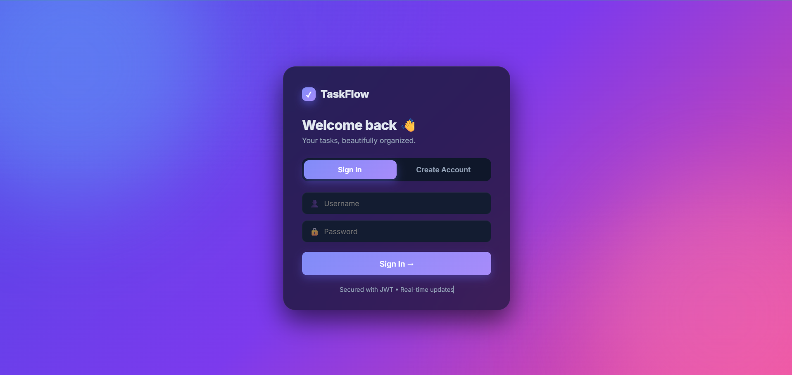
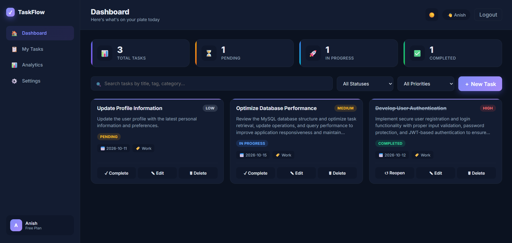
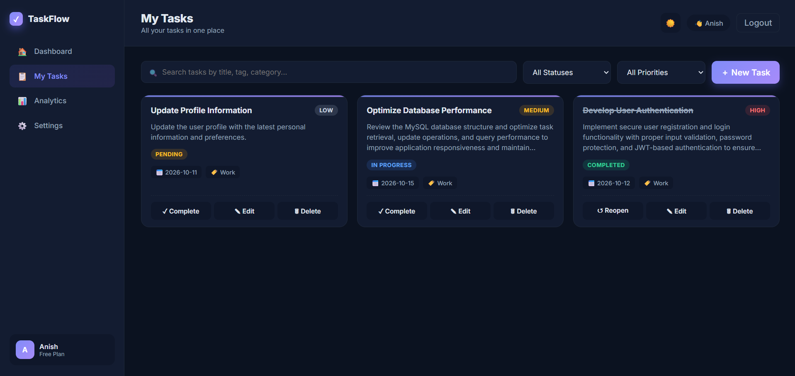
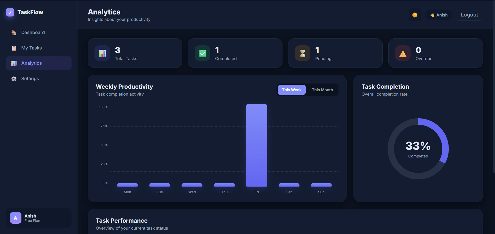
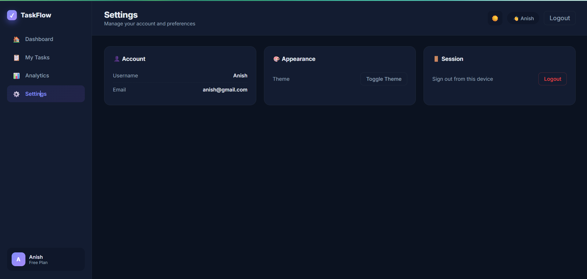

# 🚀 TaskFlow — Smart Task Management System

<p align="center">
  
  
  
  
</p>

<p align="center">
  <strong>A modern task management application designed to organize daily work, manage priorities, and track productivity through an intuitive web interface.</strong>
</p>

<p align="center">
  <a href="https://github.com/saurav-kumar-tech/TaskFlow">📂 View Repository</a> •
  <a href="#-features">✨ Features</a> •
  <a href="#-screenshots">📸 Screenshots</a> •
  <a href="#-installation--setup">⚙️ Installation</a>
</p>

---

## 📌 Overview

**TaskFlow** is a full-stack task management application built using Java, Spring Boot, MySQL, and web technologies.

It provides a centralized workspace for organizing tasks, managing priorities, monitoring progress, and reviewing productivity analytics.

The project combines frontend development, backend services, database integration, and authentication to demonstrate the development of a structured web application.

### 🎯 Project Objectives

- Simplify everyday task management.
- Organize tasks and priorities efficiently.
- Track task progress through a centralized dashboard.
- Store application data using MySQL.
- Implement authentication and backend security.
- Provide a clean and intuitive user interface.

---

## ✨ Features

| Feature | Description |
|---|---|
| 🔐 User Authentication | Registration and login functionality |
| 🛡️ JWT Security | Token-based authentication support |
| 📊 Dashboard | Centralized overview of task information |
| ✅ Task Management | Create, view, update, and manage tasks |
| 🎯 Priority Management | Organize tasks according to priority |
| 📈 Analytics | Review task progress and productivity information |
| ⚙️ Settings | Access application preferences and settings |
| 🔔 WebSocket Support | Backend support for real-time notifications |
| 🗄️ Database Integration | Persistent data storage using MySQL |
| 🎨 Web Interface | HTML, CSS, and JavaScript-based frontend |

---

## 🛠️ Tech Stack

### Backend
- **Java** — Core programming language
- **Spring Boot** — Backend application framework
- **Spring Security** — Security configuration
- **JWT** — Token-based authentication
- **Spring Data JPA / Hibernate** — Database access and ORM
- **WebSocket** — Real-time communication support
- **Maven** — Dependency and build management

### Frontend
- **HTML5** — Page structure
- **CSS3** — Styling and layout
- **JavaScript** — Client-side interactions

### Database
- **MySQL** — Relational database

### Development Tools
- Visual Studio Code
- Git and GitHub
- Apache Maven

---

## 📸 Screenshots

Explore the TaskFlow interface through the screenshots below.

### 1. 🔐 Login Page

<p align="center">
  
</p>

<p align="center"><em>Login interface for accessing the application.</em></p>

### 2. 📊 Dashboard

<p align="center">
  
</p>

<p align="center"><em>A centralized view for monitoring tasks and progress.</em></p>

### 3. ✅ Task Management

<p align="center">
  
</p>

<p align="center"><em>Organize and manage tasks in one place.</em></p>

### 4. 📈 Analytics

<p align="center">
  
</p>

<p align="center"><em>Review task progress and productivity information.</em></p>

### 5. ⚙️ Settings

<p align="center">
  
</p>

<p align="center"><em>Application preferences and settings.</em></p>

---

## ⚙️ Installation & Setup

Follow these steps to run TaskFlow locally.

### Prerequisites

Install the following software:

- Java JDK
- Apache Maven
- MySQL Server
- Git (optional)

### Step 1: Clone the Repository

```bash
git clone https://github.com/saurav-kumar-tech/TaskFlow.git
cd TaskFlow
```

### Step 2: Create the Database

Open MySQL and execute:

```sql
CREATE DATABASE task_manager;
```

### Step 3: Configure Environment Variables

TaskFlow reads its database settings and JWT signing secret from environment variables.

| Variable | Purpose |
|---|---|
| `DB_URL` | MySQL connection URL |
| `DB_USERNAME` | MySQL username |
| `DB_PASSWORD` | MySQL password |
| `JWT_SECRET` | Secret used for JWT signing |

For a local MySQL installation, the connection URL can be:

```text
jdbc:mysql://localhost:3306/task_manager?createDatabaseIfNotExist=true&useSSL=false&serverTimezone=Asia/Kolkata&allowPublicKeyRetrieval=true
```

**Windows PowerShell example** (for the current terminal session):

```powershell
$env:DB_URL="jdbc:mysql://localhost:3306/task_manager?createDatabaseIfNotExist=true&useSSL=false&serverTimezone=Asia/Kolkata&allowPublicKeyRetrieval=true"
$env:DB_USERNAME="root"
$env:DB_PASSWORD="your_mysql_password"
$env:JWT_SECRET="your_secure_generated_secret"
```

Replace the example values with your own configuration and a securely generated JWT secret.

> **Security note:** Never publish actual database passwords or JWT secrets to GitHub. These PowerShell environment variables apply only to the current terminal session.

### Step 4: Run the Application

From the project root, execute:

```bash
mvn spring-boot:run
```

Alternatively, on Windows, try the included script:

```bat
run.bat
```

Ensure MySQL is running and all required environment variables are configured before starting the application.

### Step 5: Open TaskFlow

Once the application starts successfully, open:

**http://localhost:8080**

---

## 📁 Project Structure

```text
TaskFlow/
├── screenshots/
│   ├── 1-login.png
│   ├── 2-dashboard.png
│   ├── 3-task-management.png
│   ├── 4-analytics.png
│   └── 5-settings.png
├── src/
│   └── main/
│       ├── java/com/taskmanager/
│       │   ├── config/
│       │   ├── controller/
│       │   ├── dto/
│       │   ├── model/
│       │   ├── repository/
│       │   ├── security/
│       │   ├── service/
│       │   └── websocket/
│       └── resources/
│           ├── application.properties
│           └── static/
│               ├── css/
│               ├── js/
│               └── index.html
├── .gitignore
├── pom.xml
├── README.md
└── run.bat
```

---

## 🔒 Security & Configuration

- Database connection details are supplied through environment variables.
- JWT signing uses the `JWT_SECRET` environment variable.
- Never commit passwords, private keys, production secrets, or database backups.
- Configure HTTPS and production database access before public deployment.
- Review authentication, authorization, and CORS settings before production use.

---

## 🔮 Future Enhancements

- [ ] Deploy the application with a production database
- [ ] Add email notifications and task reminders
- [ ] Improve task filtering and search
- [ ] Expand analytics and reporting
- [ ] Add automated testing and CI/CD
- [ ] Enhance the mobile experience

---

## 👨‍💻 Developer

**Saurav Kumar**

Java | Spring Boot | MySQL | Web Development

- **GitHub Profile:** [saurav-kumar-tech](https://github.com/saurav-kumar-tech)
- **Project Repository:** [TaskFlow](https://github.com/saurav-kumar-tech/TaskFlow)

---

## 📄 License

No license has been specified yet. Consider adding an appropriate license if you intend to define how others may use, modify, or distribute this project.

---

<p align="center">
  <strong>⭐ If you find TaskFlow interesting, consider starring the repository!</strong>
</p>

<p align="center">
  Built with Java, Spring Boot, MySQL, and a focus on productive task management.
</p>
